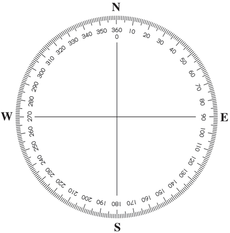

## Cylon.js Ollie Setup

Install 'cylon bluetooth low energy' module

  `npm i -g cylon-ble`

make sure it builds correctly..
check for any errors, I had build errors

I had to:

  `sudo apt-get install libudev1 libudev-dev`

Then install cylon-ble globally again:

  `npm i -g cylon-ble`

### Setting permissions to access bluetooth w/out sudo

Create variable equal to path to node: ( `$` is variable in BASH )

  `whichNode=$(eval readlink -f `which node`)`

Display path to node installation:

`echo $whichNode`

`sudo setcap cap_net_raw+eip $whichNode`

Try scan for bluetooth devices..

  `cylon-ble-scan`

Create a new npm project with a name which isn't cylon  

  `npm init` ( inside a folder )

Install cylon, cylon-ble (cylon bluetooth-low-energy) & cylon-sphero-ble (module for talking to sphero w/ cylon)

  `npm i --save cylon cylon-ble cylon-sphero-ble`

Create an index.js (or any file name you like).

Copy/paste code from the 'how to use' section at https://cylonjs.com/documentation/drivers/ollie/

Replace UUID number in connections section with the UUID of your device.

Run in terminal with `node index.js`

---

